<div align="center">

# ✨ CustomizeYouProfile

English · [Русский](README.ru.md)

**Animated effects for your GitHub profile, drawn from *your* GitHub data and refreshed every day.**

### [🎛 Open the configurator →](https://qwerty-ll.github.io/CustomizeYouProfile/)
Pick effects, preview them on your own profile and add them in one click. No terminal needed.

[](https://github.com/qwerty-ll/CustomizeYouProfile/actions/workflows/test.yml)
[-8A63D2?logo=anthropic&logoColor=white)](#-built-with-ai)

[Quick start](#-quick-start) · [Gallery](#-gallery) · [Seasonal modes](#-seasonal--personal-modes-opt-in) · [Options](#%EF%B8%8F-options) · [FAQ](#-faq)

</div>

## 🚀 Quick start

### 🎛 In the browser (easiest)

Open the [configurator](https://qwerty-ll.github.io/CustomizeYouProfile/), enter your username and pick effects; the preview is drawn from your own public data. Then press **Add workflow on GitHub**: GitHub opens with the file already filled in, and you only have to commit it. No profile repository yet? The configurator helps you create one first.

### 💻 One command

```bash
CYP_NAME="Mona" CYP_TAGLINE="Frontend dev|Cat person" \
  bash <(curl -fsSL https://raw.githubusercontent.com/qwerty-ll/CustomizeYouProfile/main/install.sh) intro,rpg-card,dino-run
```

- Needs a macOS or Linux terminal and the [GitHub CLI](https://cli.github.com), logged in (`gh auth login`).
- List the effects you want, or `all`. The variables in front are optional: `CYP_NAME`, `CYP_TAGLINE`, `CYP_SKILLS`, `CYP_STYLE`, `CYP_LANGUAGE`, `CYP_SEASONS`, `CYP_BIRTHDAY`, `CYP_COUNTDOWN` and `CYP_README_POSITION` take the same values as the matching [options](#%EF%B8%8F-options).
- The script creates your profile repository if you don't have one, adds the workflow and starts the first run. About a minute later the effects are on your profile.
- Put `DRY_RUN=1` in front to see what it would do without changing anything.

### 🛠 Manual setup

1. Your profile page is the README of a public repository named exactly like your username (`<you>/<you>`). Create it if you don't have one yet.
2. Add `.github/workflows/profile-effects.yml` to it:

```yaml
name: Profile effects

on:
  schedule:
    - cron: "0 3 * * *"   # every day
  workflow_dispatch:       # adds a "Run workflow" button
  push:                    # also run right after this file is added or edited
    paths: [".github/workflows/profile-effects.yml"]

permissions:
  contents: write

concurrency:
  group: profile-effects

jobs:
  effects:
    runs-on: ubuntu-latest
    steps:
      - uses: actions/checkout@v4
      - uses: qwerty-ll/CustomizeYouProfile@v1
        with:
          effects: intro, skills, rpg-card, dino-run
          name: "Mona"
          tagline: "Frontend dev|Cat person|Ships on Fridays"
          skills: "TypeScript, React, Go, Figma"
```

3. Commit it. The first run starts by itself (or open **Actions** → **Profile effects** → **Run workflow**). It saves the images to `profile-effects/` and adds them to a [marked block](#will-it-overwrite-my-readme) in your README.

## 🎨 Gallery

These previews are regenerated every day from [@qwerty-ll](https://github.com/qwerty-ll)'s real data, which is exactly what you'll get with yours.

### About you

**Intro** (`intro`): a waving hand, *Hi, I'm …*, lines about you typed one by one, and a few quiet stat pills. Text from `name` and `tagline`.
<picture>
  <source media="(prefers-color-scheme: dark)" srcset="examples/intro-dark.svg">
  
</picture>

**Tech stack** (`skills`): two slow rows of pills gliding in opposite directions. Your `skills` list, or your top languages.
<picture>
  <source media="(prefers-color-scheme: dark)" srcset="examples/skills-dark.svg">
  
</picture>

**RPG card** (`rpg-card`): your profile as a character sheet with a level, an XP bar, six stats, a class from your top language (*TypeScript Paladin*, *Python Mage*…) and achievements.

**Languages** (`languages`): your top languages by code size in public repositories, as a neon equalizer bouncing like music.

### Your contribution year

**Dino run** (`dino-run`): Chrome's offline T-rex runs through your year and jumps over your busiest days as cacti (taller cactus, busier day), until *GAME OVER*.
<picture>
  <source media="(prefers-color-scheme: dark)" srcset="examples/dino-run-dark.svg">
  
</picture>

**Fireworks** (`fireworks`): one rocket per month over a night city (a busy month bursts big, a quiet one fizzles), then the finale's sparks draw your whole graph in the sky.

**Black hole** (`black-hole`): your graph spirals into a black hole, collapses in a big bang and re-forms.

**Oscilloscope** (`oscilloscope`): an old CRT scope sweeps a green phosphor trace of your daily commits.

**Terminal** (`terminal`): a terminal types `git log --stats`, prints your graph as ASCII art, then your best day, streaks, top weekday and month, and commits per month.

**Notebook** (`notebook`): a pencil shades your year into a squared school notebook, then the teacher circles an **A+** (a «5+» with `language: ru`).

**Space shooter** (`space-shooter`): a spaceship shoots down your commits as they fly at it, biggest first.
<picture>
  <source media="(prefers-color-scheme: dark)" srcset="examples/space-shooter-dark.svg">
  
</picture>

<details>
<summary><b>Prefer neon?</b> Add <code>style: neon</code> for glowing synthwave versions of <code>intro</code>, <code>skills</code> and <code>dino-run</code>.</summary>


</details>

## 🎉 Seasonal & personal modes (opt-in)

Extra looks that switch on by themselves on the right dates, but only if you set them; leave these inputs empty and nothing changes. `seasons: all` turns on both seasons. Dates are in UTC, and the images change with the next daily run.

| Input | When | What changes |
|---|---|---|
| `seasons: new-year` | Dec 15 – Jan 10 | Snow and a blinking garland on every effect. The dino wears a Santa hat and jumps over Christmas trees, and the fireworks finale says *Happy New Year* |
| `seasons: halloween` | Oct 24 – Nov 1 | Bats, a spider and jack-o'-lanterns on every effect. The dino jumps over pumpkin towers, and the fireworks turn orange and purple |
| `birthday: "03-15"` | on that day | Confetti, balloons and a *Happy birthday* ribbon on every effect. The intro types *it's my birthday today!* and the fireworks finale says *Happy birthday* |
| `countdown: 2026-12-31 Release; birthday` | every day | A flip-clock `countdown` card for up to 3 dates (`birthday` counts to your next one and needs the `birthday` input). The intro types *N days until …* |

<details>
<summary>Previews: New Year, Halloween, birthday, countdown</summary>
<table>
<tr><td><b>new-year</b><br><picture><source media="(prefers-color-scheme: dark)" srcset="examples/modes/new-year/dino-run-dark.svg"></picture></td></tr>
<tr><td><b>halloween</b><br><picture><source media="(prefers-color-scheme: dark)" srcset="examples/modes/halloween/dino-run-dark.svg"></picture></td></tr>
<tr><td><b>birthday</b><br><picture><source media="(prefers-color-scheme: dark)" srcset="examples/modes/birthday/intro-dark.svg"></picture></td></tr>
<tr><td><b>countdown</b><br>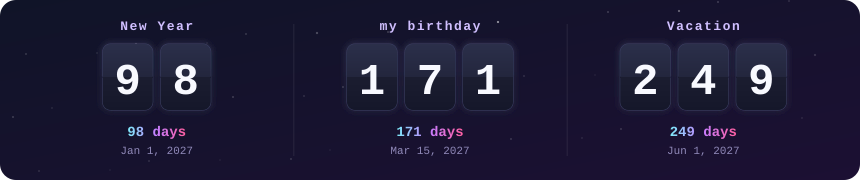</td></tr>
</table>
</details>

## ⚙️ Options

| Input | Default | What it does |
|---|---|---|
| `effects` | `dino-run` | Effect ids separated by commas, or `all`: `intro`, `skills`, `rpg-card`, `languages`, `dino-run`, `fireworks`, `black-hole`, `oscilloscope`, `terminal`, `notebook`, `space-shooter`. `countdown` is added by itself when the `countdown` input is set |
| `style` | `clean` | `clean`: calm GitHub colors with light and dark versions. `neon`: the glowing synthwave look for `intro`, `skills` and `dino-run` |
| `name` | your GitHub name | Name shown in `intro` |
| `tagline` | a few facts about you | Lines typed in `intro`, separated by <code>&#124;</code> |
| `skills` | your top languages | Comma-separated list for `skills` |
| `language` | `en` | `en` or `ru`: the text inside `notebook`, the countdown card and the seasonal greetings |
| `seasons` | off | `new-year`, `halloween` or `all` |
| `birthday` | off | Your birthday as `MM-DD` |
| `countdown` | off | Up to 3 dates separated by `;`, each `YYYY-MM-DD Label` or `birthday` |
| `today` | the real date | Pretend it's another day (`YYYY-MM-DD`) to preview the modes |
| `readme` | `README.md` | README to add the images to; created if missing |
| `readme-position` | `top` | Where the block goes the first time: `top` or `bottom` |
| `update-readme` | `true` | `false`: only write the SVG files and place them yourself |
| `output-dir` | `profile-effects` | Folder for the SVG files |
| `commit` | `true` | `false`: don't commit and push; handle it in your own steps |
| `commit-message` | `Update profile effects` | Commit message |
| `login` | the repository owner | Whose data to draw |
| `token` | `github.token` | Token for reading the data; see [private contributions](#private-contributions-arent-counted) |

## ❓ FAQ

### Will it overwrite my README?
No. The images live between `<!-- customize-you-profile:start -->` and `<!-- customize-you-profile:end -->`, and only that block is ever rewritten.
- The first run adds the block at the top of your README (or the bottom, with `readme-position: bottom`) and creates the README if there is none; any capitalization of `README.md` counts. After that, move the block anywhere: everything around it is kept.
- If the markers get damaged (one deleted, or two blocks), the README is left alone and the run shows a warning.
- Don't edit inside the block. To arrange the images your own way, say side by side in a table, set `update-readme: false` and link `profile-effects/<effect>.svg` yourself.
- The installer won't replace a `profile-effects.yml` workflow that isn't from this project, unless you add `FORCE=1`.

### What data does it read?
Only the account it draws (the repository owner, or `login`): the contribution calendar and yearly totals, name, avatar, account age, followers, PR and issue counts, and the account's own public repositories (the 100 most-starred, for stars and languages). Private repositories are never read, so their names and languages can't leak into a public image. Every profile gets its own images; even the scenery, like stars and city lights, is seeded from the username.

### Is it safe?
The workflow only gets `contents: write` on your profile repository, the token is only sent to `api.github.com`, and everything you type is escaped before it goes into an image. The images are **public**, so keep private things out of the inputs; if one looks like a token, the run stops instead of publishing it. `@v1` follows new releases; to review every update yourself, pin a commit instead: `uses: qwerty-ll/CustomizeYouProfile@<commit sha>`. More in [SECURITY.md](SECURITY.md).

### Private contributions aren't counted
The default `github.token` only sees public activity. To count private contributions, turn on *Private contributions* in your profile settings, create a [personal access token](https://github.com/settings/tokens) (classic, `read:user` scope), save it as a repository secret named `PROFILE_TOKEN`, and add `token: ${{ secrets.PROFILE_TOKEN }}` under `with:`.

### The images didn't change today
GitHub caches README images for a few minutes, so check again a bit later. Also look at the **Actions** tab, where a failed run shows its error (short GitHub API hiccups are retried twice, so a blip won't fail it). GitHub also pauses scheduled workflows in repositories with no activity for 60 days; if that happens, click **Enable workflow** there.

### Do I need to update anything later?
No. Every run draws the last 12 months, and `@v1` picks up new releases by itself. Busy and almost empty profiles both work: sizes scale to your busiest day, and busy profiles show their biggest days.

### How do I remove it?
Delete `.github/workflows/profile-effects.yml`, the `profile-effects/` folder and the marked block in your README.

## 🤖 Built with AI

This project is made together with **Claude** (Anthropic) in [Claude Code](https://claude.com/claude-code): [@qwerty-ll](https://github.com/qwerty-ll) comes up with the ideas and direction, and Claude writes and checks the code, tests and docs. Commits made this way carry a `Co-Authored-By: Claude` line.

Found a bug or have an idea for an effect? [Open an issue](https://github.com/qwerty-ll/CustomizeYouProfile/issues/new/choose). Want to build one yourself? See [CONTRIBUTING.md](CONTRIBUTING.md).

<p align="center"><a href="LICENSE">MIT</a> © <a href="https://github.com/qwerty-ll">qwerty-ll</a> · If you like it, a ⭐ helps others find it.</p>
